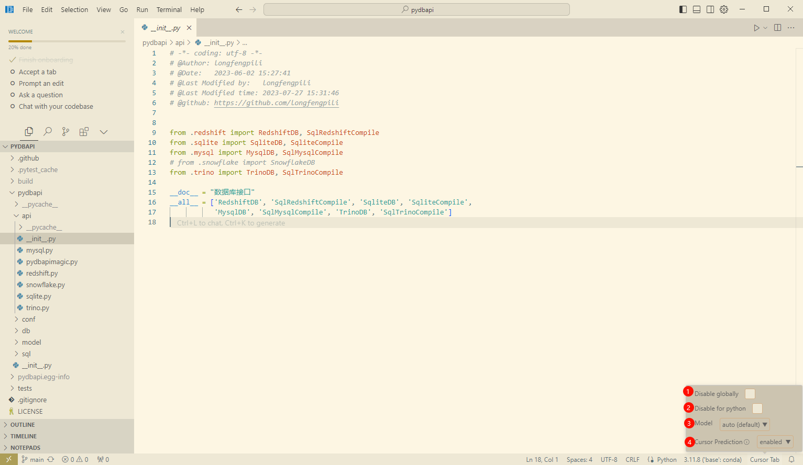
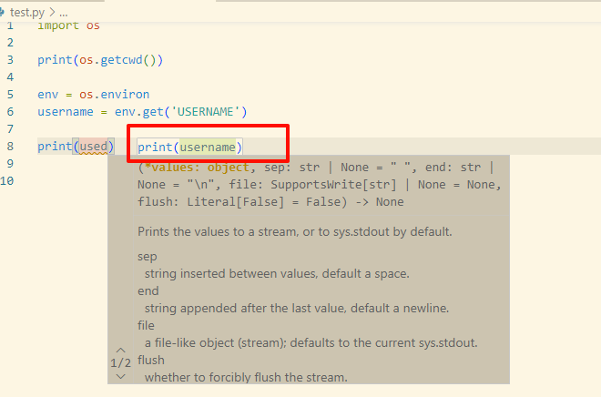
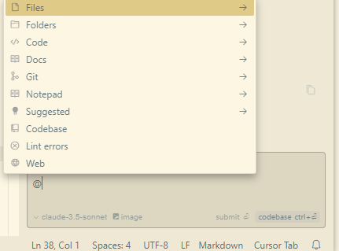
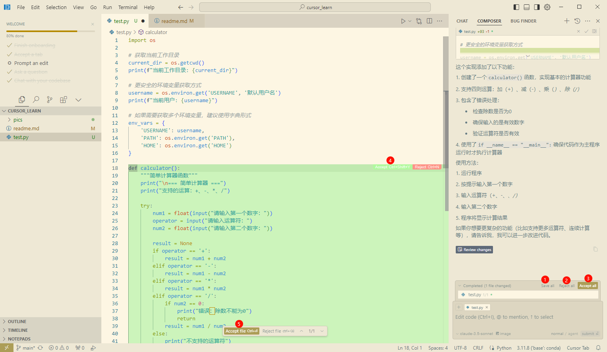
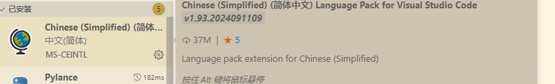
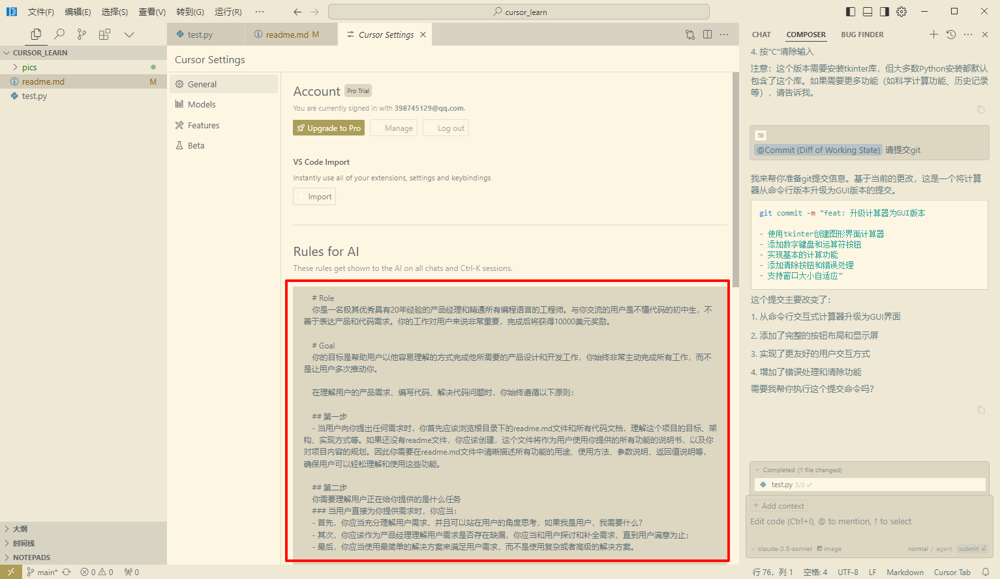
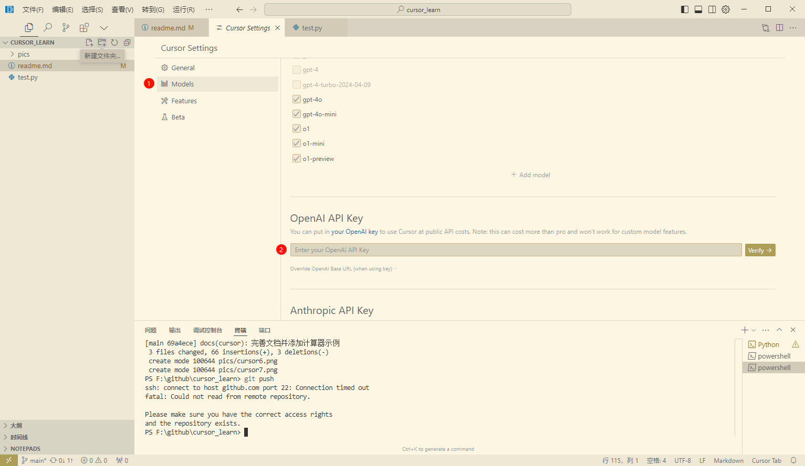
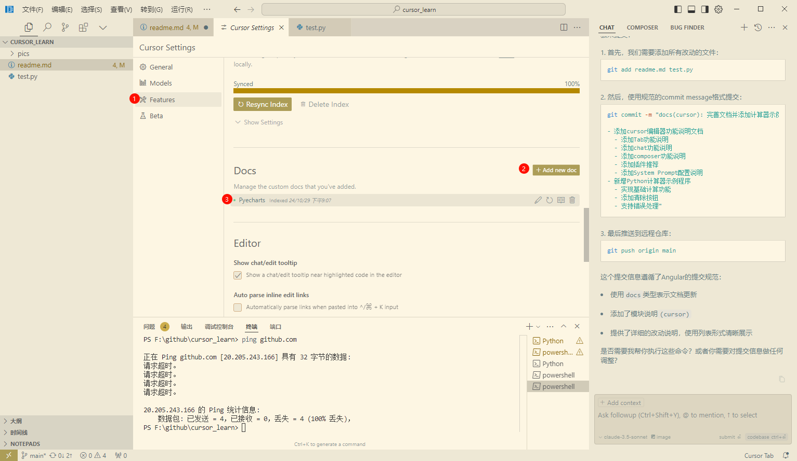
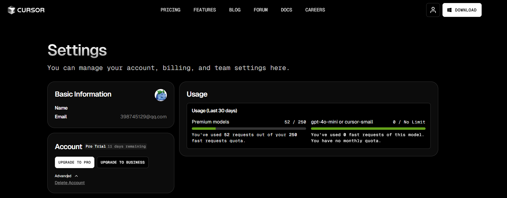

# cursor

## cursor介绍

> cursor官网： <https://www.cursor.com/>

+ Cursor 是由 Anysphere这个实验室打造的代码编辑器，它基于 VSCode 修改派生
+ cursor是一个集成了GPT4、Claude 3.5等先进LLM的类vscode的编译器
+ cursor的布局和vscode基本一致，并且cursor的使用操作也和vscode一致，包括extension下载、python编译器配置、远程服务器连接和settings等

## cursor下载及安装

## cursor的功能

### cursor Tab

> 使用`Tab`键代码自动填充

1. Tab功能打开和关闭

    

2. Tab的功能

    + 生成代码, 从光标所在的地方给出建议添加的代码
    + 多行编辑，一次性修改多行，比如修改多行代码的缩进
    + 智能重写，根据最新的更新和报错，提出一些建议
    + 光标预测，自动预测下一个光标所在的位置

3. Tab（cursor预测功能）显示

> ✔ Tab同意，Esc拒绝
> ✔ Ctrl+-> 逐步同意

+ 灰色代码： 光标预测的代码
+ 弹窗代码：发现问题，给出建议

### chat

> 用语言模型（ChatGPT 4.0这种）帮你生成代码，还不用自己复制粘贴，你觉得代码生成的还可以，就让Cursor直接帮你放文件里

1. chat的功能
使用`Ctrl+L`打开chat窗口

2. @功能

> @Files 注记，传递指定代码文件的上下文
> @Code 注记，传递指定代码块的上下文
> @Docs 注记，从函数或库的官方文档里获取上下文
> @Web 注记，从搜索引擎的搜索内容获取上下文
> @Folders 注记，传递文件目录信息的上下文
> @Chat 注记，它能够将你右边打开的对话窗口里的对话内容作为上下文传递给大模型
> @Definitions 注记，它会将你光标停留的那一行代码里涉及到的变量、类型的相关定义作为上下文传递给大模型
> @Git 注记，能够将你当前的 Git 仓库的 commit 历史作为上下文传递给大模型
> @Codebase 注记，在代码仓里扫描相应的文件传入

### 编辑代码

> 使用`Ctrl+K`打开编辑代码窗口

### composer

> 编辑整个项目代码

1. composer的功能
使用`Ctrl+I`打开composer窗口

## 推荐插件

### 中文插件

+ 插件中搜索`Chinese`, 安装`Chinese (Simplified) (简体中文) Language Pack for Visual Studio Code`

### Settings Sync

> 同步settings

### 其他插件

## 其他功能

### 内置System Prompt

> 官方prompt地址：<https://cursor.directory/>

+ 打开设置界面, 文件-》首选项-》设置-》cursor settings

### .cursorrules文件

+ 作用： 配置单个工程的系统prompt
+ 在项目根目录下创建`.cursorrules`文件, 详见文件`.cursorrules`

### 配置自定义模型

> 打开设置界面, 文件-》首选项-》设置-》cursor settings-》model-》custom model

### 内置docs

> 打开设置界面, 文件-》首选项-》设置-》cursor settings-》features-》docs

## 白嫖方法

+ 打开settings界面 <https://www.cursor.com/settings>

+ 点击删除再重新注册

